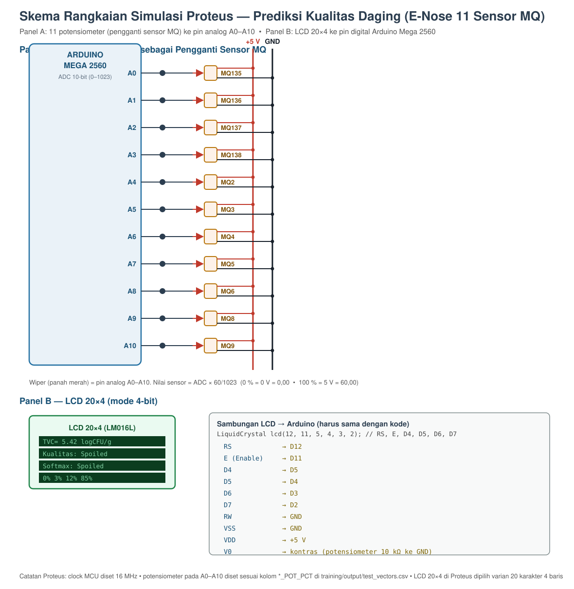

# Panduan Simulasi Proteus — Prediksi Kualitas Daging (Electronic Nose)

Panduan ini menyiapkan simulasi **Arduino Mega 2560 + 11 potensiometer + LCD 20×4**
untuk menguji `MeatQuality_NN_Arduino.ino`, lalu membandingkan hasilnya dengan
prediksi Python.

---

## 1. Komponen yang dibutuhkan

| Komponen | Jumlah | Keterangan |
|---|---|---|
| `ARDUINO MEGA 2560` | 1 | dipilih karena butuh 11 pin analog (Uno hanya 6) |
| `POT-HG` (potensiometer) | 11 | pengganti 11 sensor MQ |
| `LM016L` (LCD 20×4 karakter) | 1 | penampil hasil — di Proteus tersedia varian 20×4 |
| Resistor 220 Ω | 1 | untuk kaki backlight (bila LCD butuh) |
| Power/ground | — | dari terminal `POWER` |

> Kalau di Proteus Anda hanya punya `LM016L` 16×2, ubah di `.ino` menjadi `lcd.begin(16, 2)`
> dan sesuaikan `setCursor`/`print` agar muat (kategori + TVC saja).

---

## 2. Skema rangkaian



*File gambar: `docs/skema_proteus.svg` (bisa dibuka di browser / ditempel ke laporan).*

```
                    ARDUINO MEGA 2560
   +5V ──┬─────────────────────────────────────────────┐
         │                                             │
   POT1 ─┴── A0   (MQ135)      LCD: RS ─────── D12     │
   POT2 ──── A1   (MQ136)           E  ─────── D11     │
   POT3 ──── A2   (MQ137)           D4 ─────── D5      │
   POT4 ──── A3   (MQ138)           D5 ─────── D4      │
   POT5 ──── A4   (MQ2)             D6 ─────── D3      │
   POT6 ──── A5   (MQ3)             D7 ─────── D2      │
   POT7 ──── A6   (MQ4)             RW ─────── GND     │
   POT8 ──── A7   (MQ5)             VSS ────── GND     │
   POT9 ──── A8   (MQ6)             VDD ────── +5V     │
   POT10 ─── A9   (MQ8)             V0  ── potensiometer kontras │
   POT11 ─── A10  (MQ9)                                 │
         │                                             │
   GND ──┴─────────────────────────────────────────────┘
```

Setiap potensiometer:

```
        +5V
         │
        [==] potensiometer 10 kΩ
         │
      wiper ──────► pin analog Arduino (A0..A10)
         │
        GND
```

Wiper = 0 % → 0 V → `analogRead` ≈ 0 → nilai sensor 0,00
Wiper = 100 % → 5 V → `analogRead` ≈ 1023 → nilai sensor ≈ 60,00

### Setting komponen di Proteus

1. Tambahkan `ARDUINO MEGA 2560` → klik dua kali → **Program File** → arahkan ke
   hasil kompilasi `.ino` (di Arduino IDE: *Sketch → Export Compiled Binary*,
   lalu pilih file `.hex` di folder sketch).
2. **Ubah clock menjadi 16 MHz** (klik kanan MCU → Edit Properties → `Clock Frequency: 16MHz`).
   Ini penyebab nomor 1 simulasi lambat/aneh di Proteus.
3. Tambahkan 11 `POT-HG` pada pin A0–A10. Beri nama (`MQ135`, …) agar mudah diatur.
4. Tambahkan LCD 20×4, rangkai sesuai tabel di atas.
5. Tambahkan **Virtual Terminal** bila ingin melihat log. Hubungkan:
   - `TXD0` Arduino Mega (pin digital 1) → `RXD` Virtual Terminal
   - GND Arduino → GND Virtual Terminal
   Atur Virtual Terminal ke **9600 baud, 8 data bit, no parity, 1 stop bit (8N1)**.

---

## 3. Konversi nilai dataset → posisi potensiometer

Simulasi tidak memakai sensor asli, jadi nilai sensor dari dataset **diterjemahkan**
ke tegangan potensiometer dengan skala penuh **0–60**:

```
ADC          = (nilai_sensor / 60) × 1023
tegangan     = (ADC / 1023) × 5 V
posisi_pot   = (ADC / 1023) × 100 %      (0 % = GND, 100 % = +5V)
```

Arduino mengembalikannya lewat fungsi yang sama:

```c
nilai_sensor = analogRead(pin) * (60.0 / 1023.0);   // adcToSensor()
```

Contoh: `MQ136 = 45,12` → ADC = 45,12/60 × 1023 ≈ **769** → tegangan ≈ **3,76 V**
→ potensiometer pada ≈ **75,2 %**.

---

## 4. Data uji siap pakai

`training/output/test_vectors.csv` berisi 8 baris (2 baris per kelas kualitas, dari
potongan daging berbeda). Kolom yang dipakai:

| Kolom | Arti |
|---|---|
| `MQ135` … `MQ9` | nilai sensor yang dimasukkan ke Python |
| `MQ135_ADC` … | kode ADC yang harus terbaca Arduino (0–1023) |
| `MQ135_POT_PCT` … | posisi potensiometer dalam % |
| `ClassName` | kelas aktual menurut dataset |
| `Pred_Class`, `P_TVC`, `Pred_TVC` | hasil prediksi Python (pembanding) |

### Contoh mengisi potensiometer (baris pertama)

Misal baris 1 memberi nilai:

| Sensor | Nilai | ADC | Posisi pot |
|---|---|---|---|
| MQ135 | 17,85 | 304 | 29,7 % |
| MQ136 | 15,58 | 266 | 26,0 % |
| MQ137 | 7,95 | 136 | 13,3 % |
| MQ138 | 21,23 | 362 | 35,4 % |
| MQ2 | 16,52 | 282 | 27,5 % |
| MQ3 | 24,07 | 410 | 40,1 % |
| MQ4 | 12,29 | 210 | 20,5 % |
| MQ5 | 9,02 | 154 | 15,0 % |
| MQ6 | 14,26 | 243 | 23,8 % |
| MQ8 | 40,29 | 687 | 67,1 % |
| MQ9 | 14,40 | 246 | 24,0 % |

Cara praktis mengatur di Proteus:
1. Klik potensiometer → Edit Properties → isi `Resistance` (mis. 10k) dan lihat nilai di
   *Inspector*.
2. Cara paling akurat: **ukur tegangan wiper** dengan voltmeter virtual Proteus
   (target = `ADC/1023 × 5 V`), atau
3. Geser slider potensiometer sambil melihat **Virtual Terminal/Serial Monitor** —
   Arduino mencetak nilai tiap sensor yang terbaca, jadi Anda tinggal menggeser sampai
   nilainya sama dengan kolom `MQ135`, `MQ136`, … di CSV. Ini cara yang paling mudah
   dan paling sering dipakai saat presentasi.

---

## 5. Dua mode pengujian di dalam kode

```c
#define INPUT_MODE 0   // MODE POTENSIOMETER - demo/presentasi, baca A0..A10
#define INPUT_MODE 1   // MODE VEKTOR UJI   - nilai TEST_VECTOR di model_params.h
```

**Mode 0 (potensiometer)** — untuk presentasi: geser-geser potensiometer, lihat kategori
kualitas berubah di LCD.

**Mode 1 (vektor uji)** — untuk **verifikasi presisi**: nilai sensor sudah tertanam di
`model_params.h` (diambil dari satu baris dataset), jadi hasil di LCD bisa dibandingkan
**persis angka-per-angka** dengan prediksi Python. Ini yang dipakai saat membahas
"perbandingan model komputer vs mikrokontroler" di laporan.

---

## 6. Yang tampil di LCD 20×4

```
Baris 0:  TVC=5.42 logCFU/g
Baris 1:  Kualitas: Spoiled
Baris 2:  Softmax: Spoiled
Baris 3:  0% 3% 12% 85%
```

| Baris | Isi | Asal |
|---|---|---|
| 0 | Estimasi TVC (log10 CFU/g) | cabang regresi NN |
| 1 | Kategori kualitas final | hasil threshold TVC (`qualityFromTVC()`) |
| 2 | Kategori dari model klasifikasi | `argmax` softmax |
| 3 | Probabilitas tiap kelas | output softmax × 100 |

Bila baris 1 dan baris 2 berbeda, artinya kedua cabang output "tidak sepakat" —
biasanya karena TVC hasil regresi berada sangat dekat dengan ambang 3,0 / 4,0 / 5,0.
Ini justru bahan analisis yang bagus untuk laporan.

Virtual Terminal pada TX0 (9600 baud) menampilkan detail: nilai tiap sensor, hasil normalisasi,
probabilitas softmax, estimasi TVC, dan keputusan akhir.

---

## 7. Verifikasi tanpa Proteus (opsional tapi disarankan)

Kode Arduino yang sama bisa dijalankan di PC untuk membuktikan perhitungannya benar:

```bash
python verification/verify_cpp_vs_keras.py
```

Skrip ini mengompilasi `MeatQuality_NN_Arduino.ino` memakai g++ (dengan stub
`verification/stubs/`), menjalankannya untuk setiap baris `test_vectors.csv`, lalu
menulis tabel perbandingan ke `training/output/verifikasi_cpp_vs_keras.md`.
Inilah bukti kuantitatif untuk bagian **Analisis** pada laporan.

---

## 8. Daftar masalah umum di Proteus

| Gejala | Penyebab & solusi |
|---|---|
| LCD tampil blok hitam semua | V0 (kontras) belum diatur — pasang potensiometer 10 kΩ di V0, atau ganti ke `LM016L` dengan kontras default |
| LCD kosong tapi simulasi jalan | Cek `RW` → GND, `E`, dan urutan `RS,E,D4..D7` di Proteus harus **sama** dengan baris `LiquidCrystal lcd(12, 11, 5, 4, 3, 2);` |
| Karakter LCD aneh/berkedip | Tambahkan `delay()` atau naikkan clock MCU ke 16 MHz |
| Nilai sensor tidak berubah | Wiper potensiometer belum terhubung ke pin analog / pin salah (A0–A10 pada Mega, bukan A0–A5 saja) |
| Semua kategori "Spoiled" | Potensiometer di posisi terlalu tinggi; set sesuai kolom `*_POT_PCT` |
| Hasil beda dengan Python | Biasanya karena ADC dibulatkan ke bilangan bulat (`analogRead` memang integer). Selisih kecil ini normal — lihat hasil `verifikasi_cpp_vs_keras.md` |
